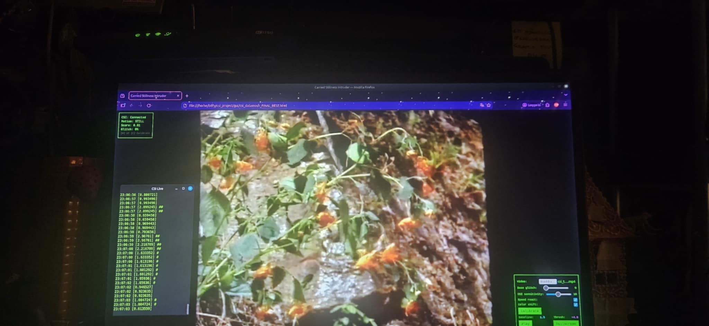

# Carried Stillness Intruder

WiFi-reactive video installation. Movement distorts the image.

Part of *Hard Copy*, bachelor's degree project at Konstfack 2026.

**Nadeschda Barenje** - [vetroal.se](https://vetroal.se)

---




---

## What is CSI?

**Channel State Information** is data about how WiFi signals move through a room. The signals bounce off walls, furniture, bodies. Every object creates a pattern of interference. When something moves, the pattern changes.

By approaching signals as a body that does not see, but is seen without eyes, defined in the resistance between source and receiver, I try to look into another world.

The video glitches to show that my presence alone affects the space around me. Regardless of what I consciously intend to do, my presence is perceived.

---

## Demo

[](https://www.youtube.com/watch?v=qWLisjFUW7U)

[Watch on YouTube](https://www.youtube.com/watch?v=qWLisjFUW7U)

---

## How it works

ESP32 reads WiFi signals. When you move, the signal changes. The video gets distorted.

```
[Router] <--- WiFi ---> [ESP32] ---> [Browser] ---> [Glitchy video]
```

---

## Setup

1. Flash ESP32-C6 with [ESPectre](https://github.com/francescopace/espectre)
2. Edit `PHANTOM_NODE_IP` in `gui/index.html`
3. Open in browser, drop a video
4. Move around

**[C]** = Calibrate | **[H]** = Hide UI | **[F]** = Fullscreen

---

## Soundtrack

Dopplereffekt - Cerebral (1995)

[Listen](https://www.youtube.com/watch?v=qWLisjFUW7U)

---

## Files

```
gui/index.html          <- the thing
espectre-node*.yaml     <- ESP32 configs
media/                  <- images + video
```

---

Enjoy :)
